#### Realizacion de la practica  

### Carpeta NPM, puede probar los dockers de manera aislada utilizando los comandos

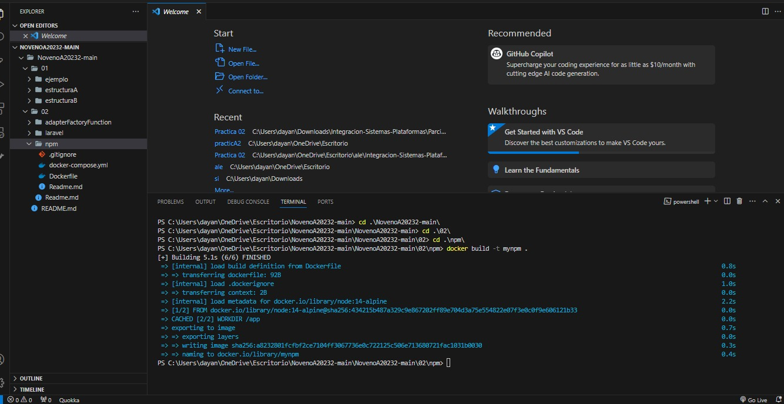
### Segundo paso
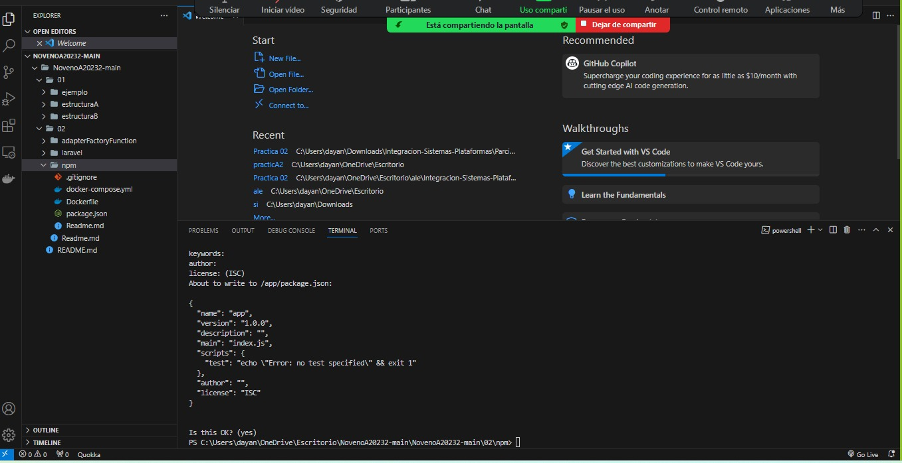
### Tercer paso
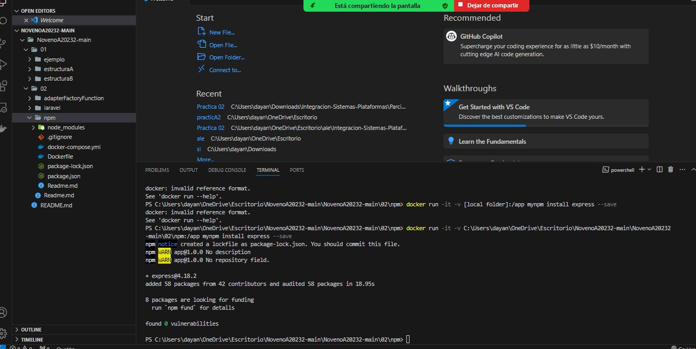
### Realiza la prueba con el Docker compose que expone losdocker-compose run npm i

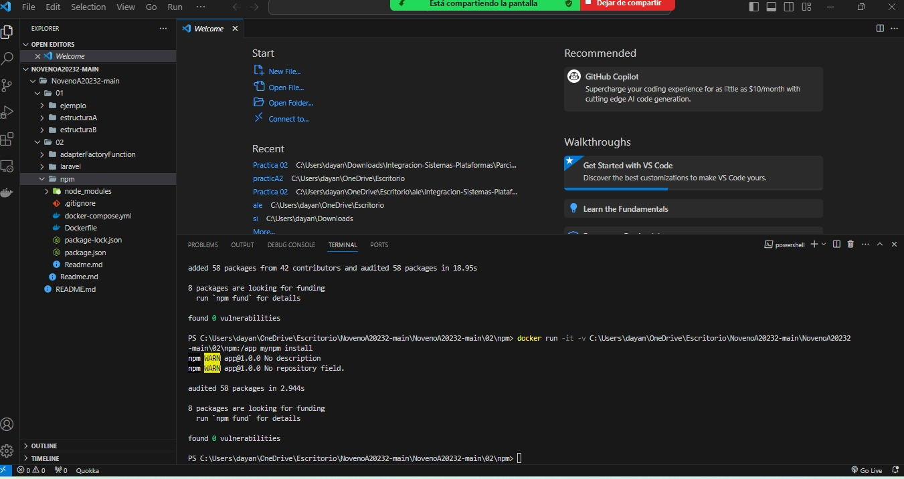

### Quinto paso
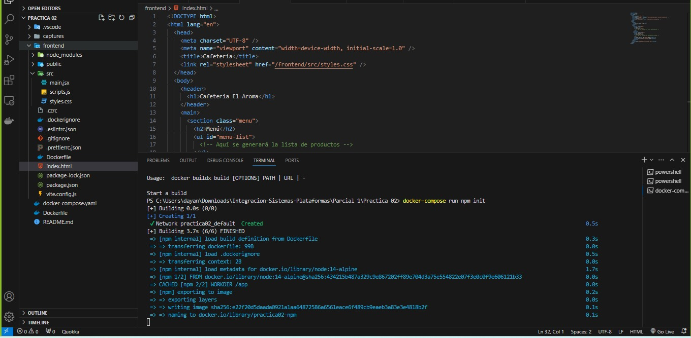
#### Sexto paso

 
 ## Ejemplo en carpeta Larave 
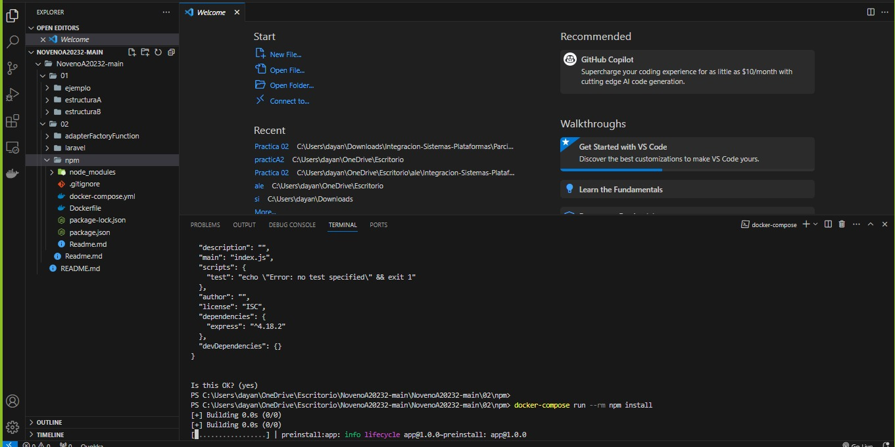
### Al levanter el docker compose podemos tener nuestro servidor de Laravel
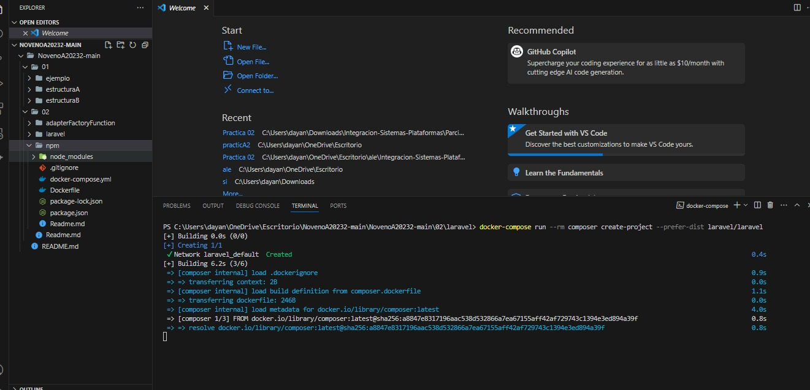
### Aplicar la herramienta migrate base de datos utilizando artisan
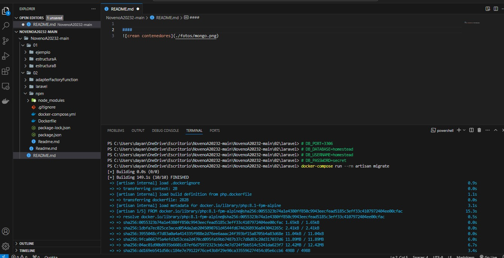
### Octavo paso

### Modo en el que podríamos aplicar cuarquier método disponible
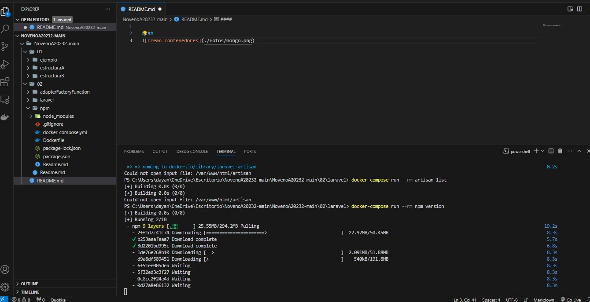
## 10 paso
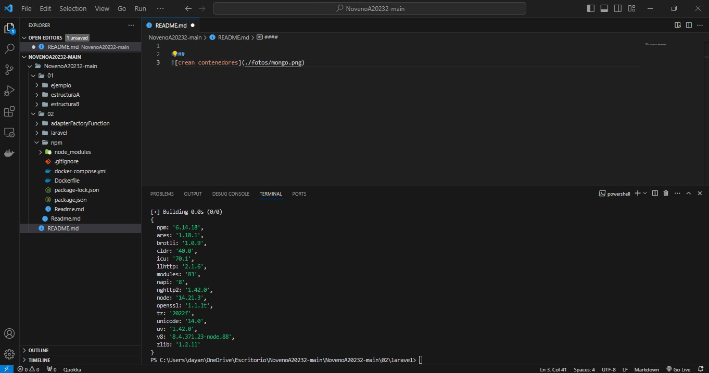

## finalizacion y desmostracion 
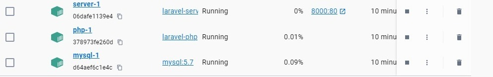