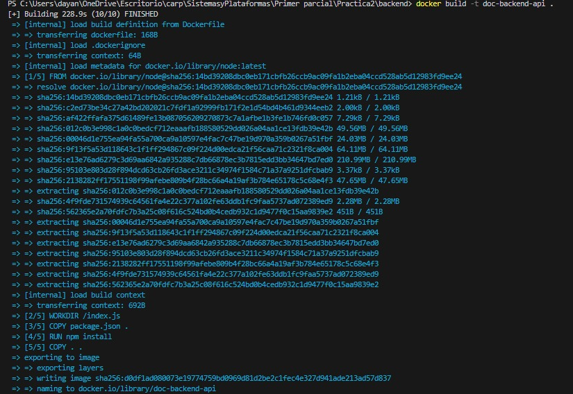
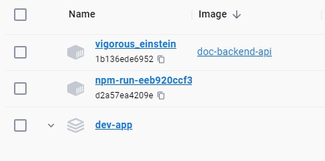
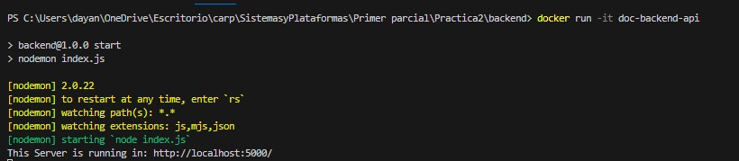
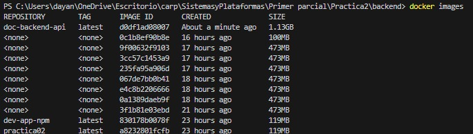

 #### Realizacion de la practica numero 2

### Crear la imagen docker que tiene como nombre doc-backend-api

### Segundo paso
### Evidencia del listado de dockers donde podemos encontrar el docker creado anteriormente con el comando docker images

### Tercer paso
### Verificacion del docker corriendo

### Cuarto paso

### Docker visualizacion desde docker desktop

